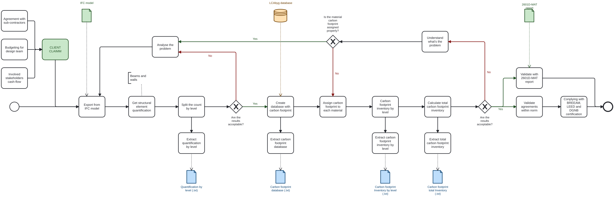
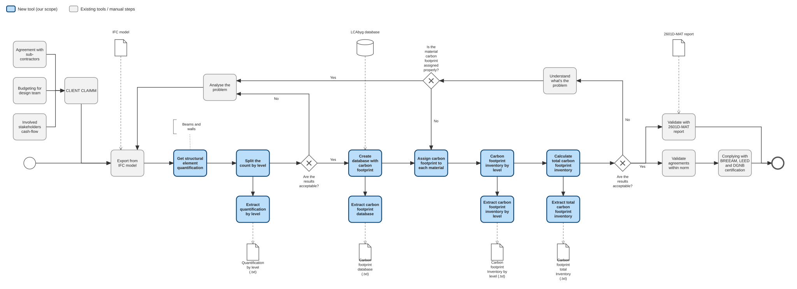

# A2 — Cost-Checking Use Case

## A2a. About Your Group
- **Group coding level (total):** 2  
- **Focus area:** Build  
- **Role:** Manager  

---

## A2b. Identify Claim
Comparison- measure the carbon footprint of the added walls and columns for the diffrent versions of the transformed 308 building.

### Building
- **ID:** #2601  

### Claim
Data visualization - Carbon footprint for the load bearing and non-load bearig walls.

### Purpose of Checking This Claim
The Main purpose of this tool is to measure the carbon footprint of different wall and column systems, and the second function is to quantify the walls of each new building.  

- **Walls:** quantity, material type, and dimensions, location.  

All elements as a general rule will use the ** LCAbyg database** for Both compliant with EN 15804+A2 for carbon footprint. 
---

## A2c. Use Case

### How Would You Check This Claim?
1. Identify the carbon footprint calim in the report and compairing.  
2. Analysts each develop Python tool to read and get all the attributes and calculate the carbon foot print for each. 
3.  Manager integrates all results into a single platform. 
4.  Extract quantities using **ifcOpenShell**. 
5.  Intergrate results with ** LCAbyg database**.

### What Phase?
**Tender phase (Build focus area)**

((At this stage, verified cost estimates ensure bids reflect accurate quantities and materials, reducing financial risk before construction begins.))

### What Information Does This Claim Rely On?

See - Analyst groups.

### What BIM Purpose Is Required?
**Analyse** (extract and compute), then **Communicate** (report to stakeholders).

### Closest BIM Use Case
((**Use Case 02 — Cost Estimation**))

((### BPMN Diagram

[View Flow_Diagram (file)](./flow.svg)

## A2d. Scope the Use Case

[View Scope (file)](./scope.svg)))

## A2e. Tool Idea

### Overview
Python-based **carbon footprint measuring tool** using ifcOpenShell.

### Core Function
Automatically extract new walls/columns and theirdimensions, area and materials from an IFC model, combine with LCAbyg database carbon footprint for each material, and calculate total carbon footprint for each new wall or column and overall.

### Features
- Integrates results from multiple analysts, scripts  
- Visualises data and creates reports  
- Supports **OpenBIM** principles of interoperability, collaboration, and traceability

### Business Value
- Automates carbon footprint for any added element to any model.
- Improves accuracy and efficiency  

### Societal Value
- Promotes transparency and sustainability through OpenBIM standards  

## A2f. Information Requirements

### Information to Extract
| Category | IFC Class | Data Needed |
|-----------|------------|--------------|
| Columns | `IfcColumn` | Quantity, material, dimensions |
| walls | `IfcWall` | Classification, area, material |

### Is It in the Model?
YES

### Access via ifcOpenShell?
YES
